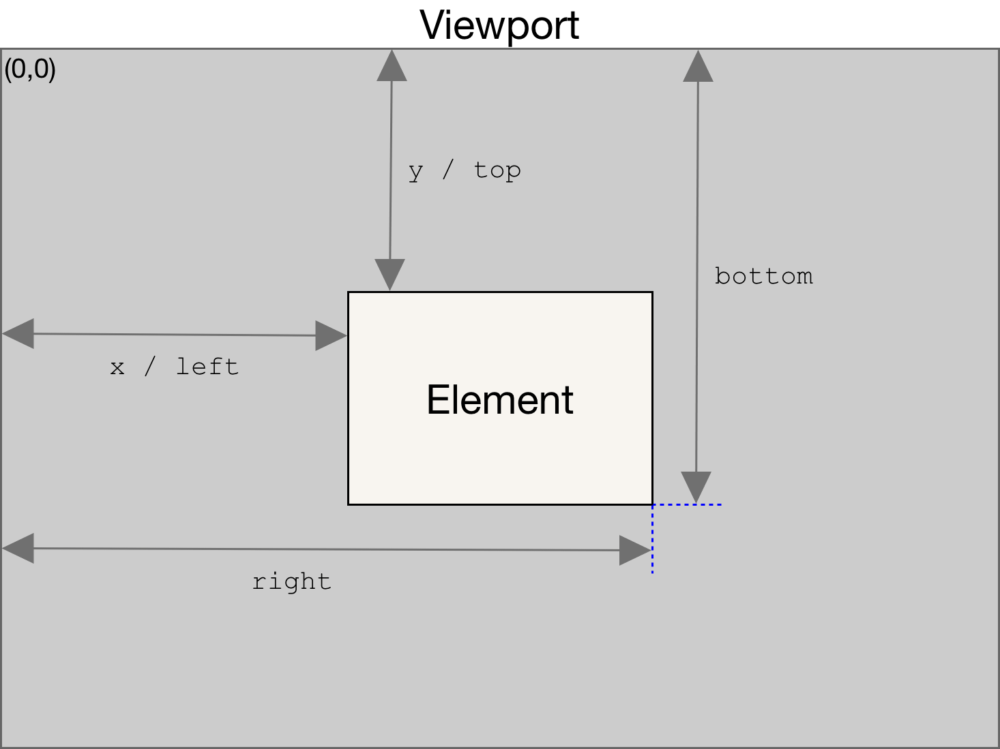

图片懒加载是一种`性能优化`手段，在很多以图文列表为主的场景使用较多，比如大部分的首页商品列表展示，由于首页渲染需要静态资源加载，数据请求，数据渲染三个过程，且首页的加载时间直接影响其**用户体验**，所有在首页中做好性能优化尤其重要。
### 原理
图片懒加载可以在首页性能优化中起到减少并发请求的作用，即，不在可视区的图片可以先不请求资源，等到下拉到一定距离或者进入可视区再请求静态资源，其原理就是：监听图片是否处于可视区位置，来判断是否发起资源请求；

### 这是本地图片

### MDN 链接的图片

### 雨雀图片
